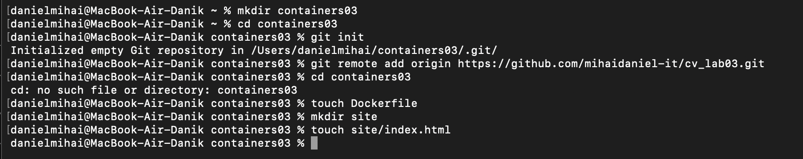
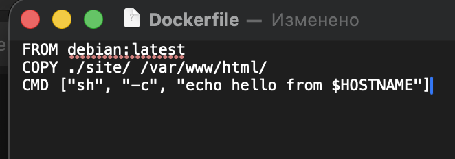
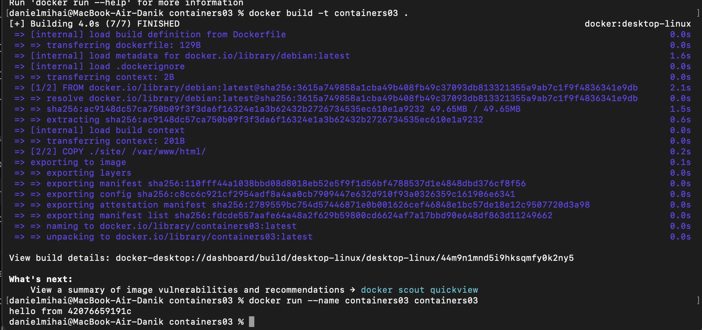
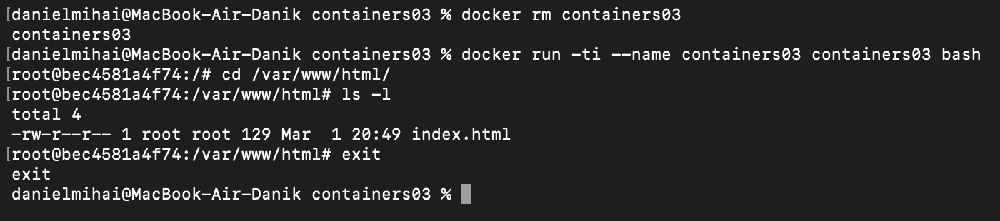

# Лабораторная работа №3  
## Первый контейнер Docker

**Студент:** Михай Даниел  
**Группа:** I2402ru  

---

## Цель работы

Изучить основы контейнеризации, установить Docker Desktop и проверить его работоспособность путём создания и запуска первого Docker-контейнера.

---

## Подготовка

Перед выполнением лабораторной работы был установлен и запущен Docker Desktop.

---

## Выполнение работы

### 1. Создание проекта и репозитория

Была создана папка проекта `containers03` и инициализирован Git-репозиторий.




---

### 2. Создание Dockerfile

В корневой папке проекта был создан файл `Dockerfile` со следующим содержимым:


---

### 3. Создание сайта

В проекте была создана папка `site`, внутри которой размещён файл `index.html` с произвольным содержимым.

📸 **Содержимое веб-страницы**


---

## Запуск и тестирование

### 4. Сборка Docker-образа



---

### 5. Запуск контейнера

онтейнер был запущен командой:
```
docker run --name containers03 containers03
```

В консоли отобразилось сообщение:
```
hello from 4207665919c
```

---

### 6. Повторный запуск в интерактивном режиме

Сначала контейнер был удалён, pатем контейнер запущен в режиме терминала.




---

### 7. Проверка содержимого каталога сайта

Внутри контейнера выполнены команды:
```
cd /var/www/html/
ls -l
```

На экране отображается файл: index.html

Это подтверждает успешное копирование файлов в контейнер при сборке образа.

После проверки работа контейнера завершена командой:
```
exit
```


---

## Выводы

В ходе лабораторной работы:

- установлен и проверен Docker Desktop  
- создан собственный Docker-образ  
- выполнена сборка контейнера на базе Debian  
- проверено копирование файлов внутрь контейнера  
- освоены базовые команды Docker  

Получены практические навыки работы с контейнеризацией, необходимые для выполнения последующих лабораторных работ.

---

## Используемые источники

1. Методические материалы курса USM  
2. Официальная документация Docker — https://docs.docker.com/  

